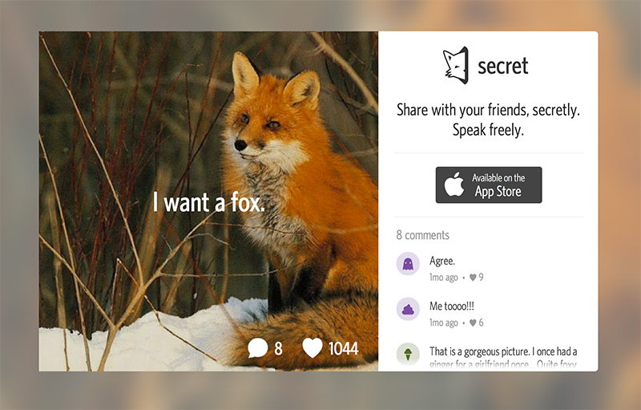
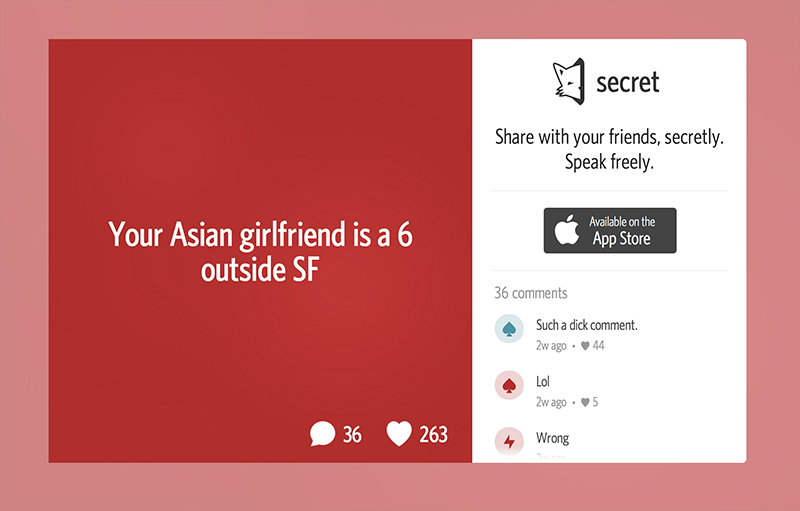
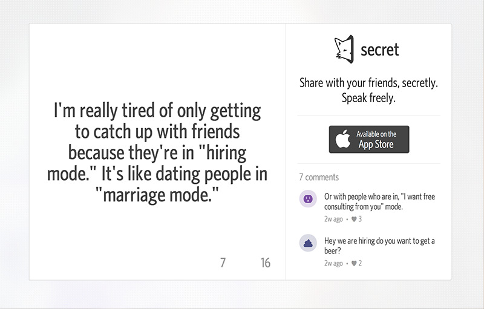
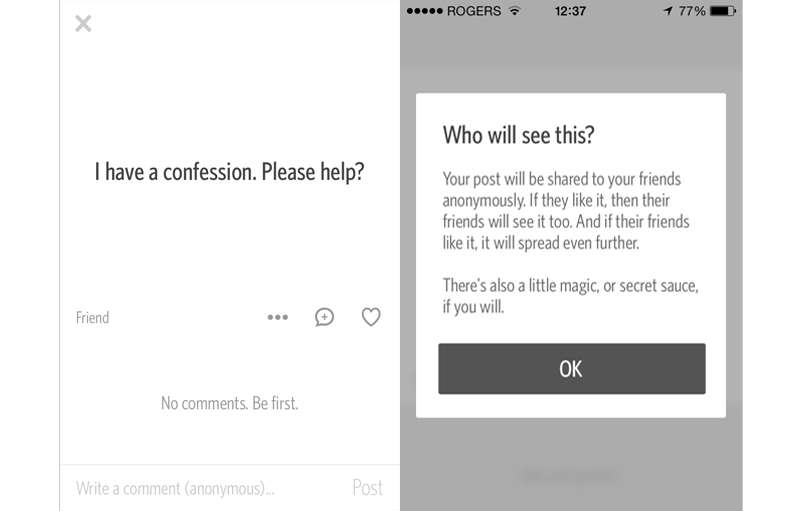

Secret just raised 8.6m dollars from top tier investors. The app was released 45 days ago, I break down some problems I have with the app.

For those that don’t know, Secret is a mobile application that allows users to share anonymous updates to friends and randoms around the world. 

<!-- more -->

> “Share with your friends, secretly. Speak freely.” - <a href="https://www.secret.ly/">secret</a> homepage

 
Here are my top 5 beefs with Secret:
 

#####1. Quality Score of Secrets
Is it fair to say most people have a handful of secrets and perhaps a skeleton or two in the closet? Pretty quickly, people run out of secrets, or at least the big juicy secrets are shared during the first few months of use. Users will start to produce fake secrets, or regular updates (that aren’t secrets) just like you would see on any other social network. 

 
 
#####2. Defamation
Secret is a breeding ground for anonymous defamation. We’ve already seen several secrets go viral that attack individuals or brands. They just introduced social sharing to encourage further defamation. 

 
 
#####3. Brings People Together for the Wrong Reasons
I believe the original goal is to bring people together and act as an outlet for advice or help. The layer of anonymity and viral loops encourage TMZ like behaviour. For people that actually need help, it doesn’t serve much purpose. There’s no support, there are no tools to actually help your friends and other people (a comment feed that turns into flame wars is not the answer). And for whistle blowers, it’s not good outlet either. You should contact the media like you’ve been doing for the last 60 years. People check Secret to get the latest gossip, it’s incredibly negative. You may as well visit <a href="http://thesuperficial.com">thesuperficial.com</a>

 
 
#####4. Friendless and Hopeless
New users without friends share secrets to no one. You can speak freely, but no one hears it. Sending friend invites will reveal your identity. 

 
 
#####5. Revenue Model
How do you monetize an anonymous product? Are you really going to promote your (defamation) secrets to more users? Will users pay to hide secrets? I'm at a loss at how they'll monetize. It contradicts their entire mission statement of 'speak freely'. 

 

          <h4>Share this story</h4>
          

<a href="https://twitter.com/share" class="twitter-share-button" data-url="http://kenny.is/5-beefs-with-secret" data-via="allbombs" data-lang="en">Tweet</a>

<iframe src="https://hn-button.herokuapp.com?title=5%20Beefs%20With%20Secret&amp;url=http%3A%2F%2Fkenny.is%2F5-beefs-with-secret&amp;&amp;count=horizontal" name="hn-button-k533o2r" id="hn-button-k533o2r" class="hn-button" data-title="5 Beefs With Secret" data-url="http://kenny.is/5-beefs-with-secret" data-count="horizontal" title="Hacker News Button" height="20" width="83" frameborder="0"></iframe>

         

