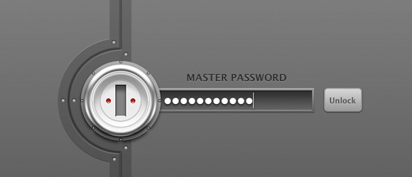
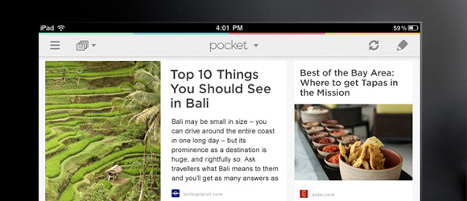
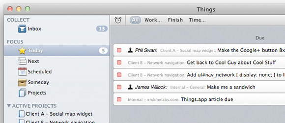

I was inspired by usethis.com and a few conversations with friends to write a post on tools, services, and applications that I use to help maximize productivity on a daily basis. My top 3 must have applications would include 1Password, Read Later, and Things. These three apps keep me grounded, focused, organized, and on task. Each app accomplishes a different goal but saves me 30-60 minutes of time per day..

<!-- more -->

<strong>1Password</strong> – https://agilebits.com/onepassword
I constantly register for beta products/startup lists. I never use the same password for any 2 sites/services and can never remember passwords. These password resets are extremely annoying, waste 15-20 minutes per day, and clutter the inbox. 1password is a bit pricey, but after 1 week of use you’ll have made your money back in free time. I use both the desktop client on my mac, and the iOs application. The mac desktop client is $49.99 and the iOs client is $9.99. If you search the internet you can find discount codes or hold out for special promotions from agile bits (makers of 1password). You can sync the desktop and mobile clients via dropbox or wifi. I love visiting an old site and not even attempting to remember the password.. I just auto complete 1password. If you use/demo one app from this blog post, it should be this one. Agile bits also have a free 30 day trial. Go try it out. There are a number of other password tools, but this one works really well for me.

<strong>Read Later</strong> – http://getpocket.com
Noise. How many tabs do you have open in your browser right this second??? How many tabs are items you want to read, but just not right now because you’re in the middle of something. That reminds you.. why are you reading this post? Shouldn’t you be maximizing your time completing x or y? I was suffering from this exact problem and read later helped me focus by simply adding links to read at a later time. They have a browser plugin, twitter plugin, and mobile application. So if friends send interesting articles via social networks, email, or im, I can quickly save those to my read later list and continue with whatever task i’m working on. Not only that, my computer runs faster and my browser is less cluttered (I used to have 3-4 browser windows open with 10-20 tabs of content.. shameful). I try to reserve 8am-6pm with getting sh#t done, and accessing my ‘read later’ list during downtime (in transit, waiting for coffee, while watching tv, saturday morning while watching EPL). Best part about this application.. it’s free!!

<strong>Things</strong> – http://culturedcode.com/things/

Things is a delightful and easy to use task manager. I use this application to enter and organize all of my to-dos. I use the desktop client and the iOs app to organize and jot down any task, small or large. When I think of a task I need to complete, I quickly add the task and revisit at the end of the day to ensure it has been tagged properly and marked with an appropriate due date. This is a paid application but combining read later and things, I have increased my productivity 10x.

Here are some other applications that see frequent use on both my iphone 4s and macbook pro:

<strong>iPhone</strong> 
<a href="http://evernote.com/" rel="nofollow">Evernote</a> &#8211; tag specific items. This is more powerful than read later. Great for tagging designs or ideas or whatever. 
<a href="http://itunes.apple.com/us/app/twitter/id333903271?mt=8" rel="nofollow">Twitter IOS Client</a> &#8211; prefer the basic app over any 3rd party client 
<a href="http://instagram.com/" rel="nofollow">Instagram</a> &#8211; photo sharing social network 
<a href="http://www.theweathernetwork.com/weatherapps/weathereye_iphone" rel="nofollow">Weather eye</a> &#8211; from the weather network, prefer this over the default weather app 
<a href="http://www.apple.com/iphone/built-in-apps/maps-compass.html" rel="nofollow">Google Maps</a> &#8211; best map service&#8230; 
<a href="http://groupme.com/" rel="nofollow">GroupMe</a> &#8211; huge time suck, but all my friends use this cross platform group messaging app 
<a href="http://www.shazam.com/" rel="nofollow">Shazam</a> &#8211; quickly identity songs in videos or when out with friends 
<a href="http://www.mixcloud.com/iphone/" rel="nofollow">Mixcloud App</a> &#8211; great for new dj sets from top djs around the world 
<a href="https://www.uber.com/" rel="nofollow">Uber</a> &#8211; getting a ride.. beats calling a taxi and you can see them on an interactive map 
<a href="http://support.google.com/accounts/bin/answer.py?hl=en&amp;answer=1066447" rel="nofollow">Google Authenticator</a> &#8211; ios app I use to authenticate my gmail account (extra security)

<strong>Macbook Pro</strong> 
<a href="http://bjango.com/mac/istatmenus/" rel="nofollow">istatmenu</a> &#8211; tells me vital information on my macs health (bandwidth, temp, memory, harddrive, nice calendar, etc) 
<a href="http://seomoz.org" rel="nofollow">seomoz</a> &#8211; site explorer is the bomb, just like my mom 
<a href="http://tools.seobook.com/seo-toolbar/" rel="nofollow">seobook toolbar</a> &#8211; quickly creep on competitors seo efforts 
<a href="http://filezilla-project.org/" rel="nofollow">filezilla</a> &#8211; default ftp client 
<a href="http://en.wikipedia.org/wiki/TextEdit" rel="nofollow">textedit</a> &#8211; text edit is my top 3 apps. I use this write copy and html 
<a href="https://trello.com/" rel="nofollow">Trello</a> &#8211; managing projects in conjunction with things 
<a href="http://google.com/mail" rel="nofollow">Gmail for email</a> &#8211; I tried mac mail and sparrow, but I stick with gmail in my browser 
<a href="http://adium.im/" rel="nofollow">Adium</a> &#8211; I run all of my i&#8217;m services through adium (@hotmail, @gmail, @mydomains) 
<a href="http://www.skype.com/" rel="nofollow">Skype</a> &#8211; video and audio calls 
<a href="http://www.omnigroup.com/products/omnigraffle/" rel="nofollow">Omnigraffle</a> &#8211; quickly building wireframes 
<a href="http://www.photoshop.com/" rel="nofollow">Photoshop</a> &#8211; creating and editing photos and designs 
<a href="http://skitch.com/" rel="nofollow">Skitch</a> &#8211; quickly adding notes for screenshots 
<a href="http://www.transmissionbt.com/" rel="nofollow">Transmission</a> &#8211; default torrent app 
<a href="http://www.videolan.org/vlc/index.html" rel="nofollow">VLC</a> &#8211; my default video player 
<a href="http://serato.com/scratchlive" rel="nofollow">Scratch Live</a> &#8211; vinyl emulation software that operates exclusively with Rane hardware (serato box) 
<a href="http://audacity.sourceforge.net/" rel="nofollow">Audacity</a> &#8211; Record dj mixes, rip vinyl to mp3 
<a href="http://www.apple.com/logicpro/" rel="nofollow">Logic Pro</a> &#8211; normalize and bounce dj mixes 
<a href="http://en.wikipedia.org/wiki/WaveBurner" rel="nofollow">Wav Burner</a> &#8211; to take my dj mixes and create cd&#8217;s

