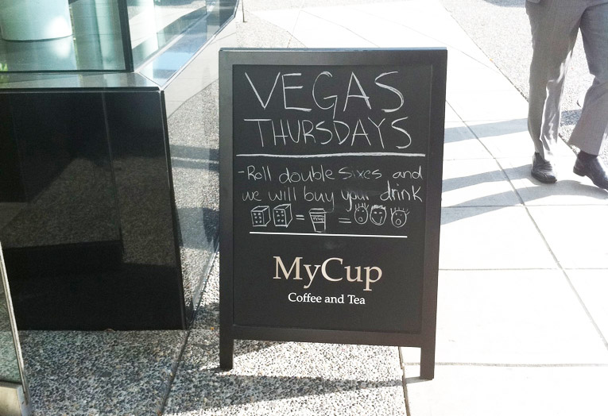

This is the final instalment of a series of blog posts that cover some predictions for local commerce for small business. Check out <a href="http://kenny.is/future-of-small-business-commerce">part 1</a> or <a href="http://kenny.is/future-of-small-business-commerce-part-2">part 2</a> for my previous predictions.

Here are the final thoughts on signals i've noticed and things your business might want to consider:

<!-- more --> 

<b>Packaging Innovation + Environmental Impact</b> 
More focus on the environment and responsible packaging of goods and services. Socially responsible companies are rewarded with long term loyal customers. Look at Wholefoods or Lululemon.

 
<b>Local Matters</b> 
City Halls compete to build entrepreneurial hubs (tax incentives, discounted rent, and support systems). Entrepreneurship is rewarded; locals want to support other locals. Food will pave the way (50 mile diet) and other verticals will follow. Businesses will collaborate to support each other with new types of marketing campaigns and local events.

 
<b>Video Commerce</b> 
Video is the most powerful medium in the world. End-to-end from advertisements, product demos, purchase authorization, delivery confirmation, and customer support.

 
<b>Live Video Shopping Channels</b> 
Brands offer live webinars where users can see new product lines and interact with makers. Think HSN (Home Shopping Network), but for big brands and marketplaces. Brands could run 24/7, or specific times during the day/week.

 
<b>Popup Stores</b> 
Online businesses and marketplaces start popup stores in strategic locations (mall, conferences, events, etc). Indochino is a great example -- they tour cities across North America to showcase their product line and allow customers to get a personal fitting. We could see kickstarter style popup stores where new or potential product lines are tested/sold in short term locations. 

 
<b>Happy Customers = Everything</b> 
Despite the new wave of marketing tools and techniques, businesses need to get back to basics. Focus on customer service, up-selling, speedy customer support, and customer happiness scores. Differentiate yourself against Amazon and your competitors. Be unique, tell your story with your unique personality and brand, but always deliver happy customers. 

  

 
 

