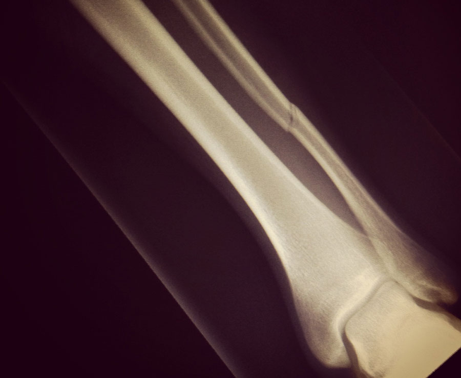

8 weeks ago I broke my left fibula in the second half of our last game of the season. I've broke several bones playing soccer before, but this time was different. The injury itself wasn't that bad, a clean break and aircast for 6-8 weeks. My season was done, but all I could think about was how this injury was going to impact my startup. It was leading into a critical time for my startup. I really needed to hustle, signup my first customers, and begin fundraising.

<!-- more -->

For those that don't know, I've been working on <a href="http://promo.co">Promo</a> 
since August of last year. Promo is a mobile application that allows small business owners to quickly build leads and sell products or services online. 

A broken leg and crutches shouldn’t impact your startup that much, right? Wrong. In the first few weeks I had hip problems and quickly discovered mobility was going to be an issue. I tried to work from the <a href="http://fullstack.ca/stackhaus/">office</a>, but led to more crazy swelling, exhaustion, hardcore armpit chafing, and crazy credit card bills from cabbing everywhere.  

For the last 7.5 weeks I've been working on my startup from my bed. It's been a pretty big challenge. 

Earlier this afternoon the doctor gave the green light for physio, but I wanted to write some quick tips for other startup founders that are forced to work from home for an extended period of time because of a medical reason.

Truth told, there were moments where (pardon the pun) things broke, ideas failed, and meetings didn’t go as planned. You start to think things are compounding and the universe thinks you suck and should quit. Fear not, follow these 5 rules to keep on trucking. 

 
<h2>5 Tips to Stay Sane Building a Startup From Your Bed
</h2>

<b>1. Support System</b> 
Build a mini support team ASAP. Try to cover off different areas with different people. Unfortunately, <a href="http://twitter.com/tawnyfontana">my girlfriend</a> ended up doing a lot of the heavy lifting and taking on a ton of responsibilities.  Try to have a support system from friends and family for: 

- Food + general groceries
- Personal support (daily human interaction + banter)
- Mental support (startup life / business)

 

<b>2. Sleep Hard, Hit Snooze Everyday</b> 
Count sheep for days. This sounds counter intuitive for a startup, but don’t be afraid to sleep more than usual. Going for an afternoon nap isn’t a big deal. Let your body heal, hit that snooze button a few more times. Ensure you get 8-10 hours of sleep every day.
 

<b>3. Eat Stupidly Well</b> 
Even if you can’t afford it, buy groceries and spoil yourself. Give your body all the nutrients it needs, and fulfill all of your horrible cravings. It can get pretty boring around the house, spice things up with different recipes or food experiments. Don’t get fat, buy organic food, take your daily vitamins.
 

<b>4. Replace Exercise With Other Outlets</b> 
Paul Graham states you should focus on building product, eating properly, sleeping properly, and getting regular exercise. In my case, I was unable to work out, so I turned to finding new outlets for release. Going for cat naps and eating well was one of those outlets, but try learning something new, or finding a new hobby. I started to write new ideas in my journal and new blog posts. Don’t be afraid to watch that movie or new TV series you’ve always wanted, hello True Detective and House Of Cards!
 

<b>5. Smile, Be Grateful</b> 
Give praise and thanks to your support group for their assistance during this challenging time. Don’t be shy to let them know how grateful you are, and how you appreciate their help. Replace in person human interaction with google hangouts and chatting via IM (gtalk, flowdock, slack).
 

Try to take things day by day with a smile on your face. Offer to help your friends, your support group, and other founders. Is there anything they need help with? 

Once healed, why not send them a thank-you card? What about creating a personal calendar reminder to send another thank-you email 3 months following your recovery?
 
 

Hope some of these tips were helpful. Let me know if you have other advice. 

<b>Edits</b>  
- Don’t be excessive. I wasn’t sleeping 16 hours a day and don’t gain 50 pounds! 
- my soccer team <a href="assets/img/roosters-win-cup.jpg">won the cup</a> 4 weeks after my injury
 
