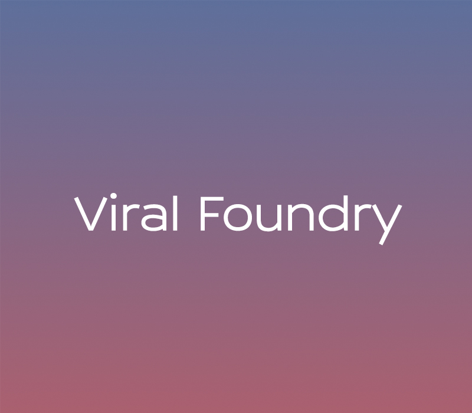

The last 6 months working as EiR at <a href="http://fullstack.ca">Full Stack</a> has been ridiculously awesome (more details + wrap up post to come). But today, I'm excited to to announce i'm starting my 'next thing'' called <a href="http://viralfoundry.com">Viral Foundry</a>. Thanks to Boris Mann, we're going to setup shop and keep playing out of the Full Stack office.

<!-- more -->

Viral Foundry is a product studio where I plan to build and test new video based products. We're also going to offer design/development/marketing services. Feel free to get in touch if you have something you want us to tackle. 

More details on our first product to follow shortly.

Check out the new website - <a href="http://viralfoundry.com">viralfoundry.com</a>

