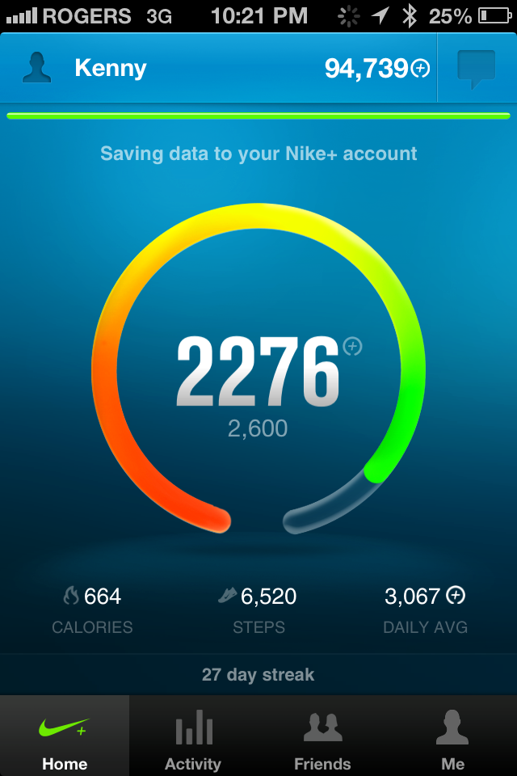

With just under a month of use, here’s my take on the Nike Fuel Band. I was pretty skeptical when I first reviewed the Nike Fuel band. The flashing lights looked pretty spiffy but would this device drive me to my daily, weekly, and monthly goals? I was really apprehensive and skeptical about wearing a tracking…

<!-- more -->

I was really apprehensive and skeptical about wearing a tracking device on my wrist after using one a few years ago. Lark is a wristband that tracks sleeping habits. It also provides a vibration alarm. It was supposed to gently vibrate you that ‘it’s time to wake up’. In theory, it’s a great idea. Track your sleeping patterns + win brownie points for being super considerate of your significant other. It didn’t last very long. After 2 weeks, I found the device to be a negative hassle. I had an early version of the product (Techcrunch Disrupt NYC), but found the application wasn’t fully polished, the vibrations were aggressive (no difference to regular alarm noises), and my partner would wake from the vibration sounds. The sleeping reports caused more stress as it reminded me of how sleep deprived I was. Basically the last thing you want when you’re in the middle of a product sprint (Horrible logic.. i know). So for me, purchasing another tracking device was a big ask.

I registered for the Vancouver BMO marathon slated for May 4th, and figured it would be a great way to measure my training and progress leading up to the race. Some friends and coworkers are also using the band, I figured it could be some fun and bragging rights around the office. I read a few reviews and liked the fact that most people didn’t notice they were actually wearing it after a few days of use. I caved, and here we are 1 month after purchase. Here’s my review:

First week was interesting. It took 5 days to adjust to constantly wearing the band. They have inserts to adjust the band size to properly fit your wrist. I wanted a tighter band so it wouldn’t roam up and down from my elbow to wrist. I accidentally pinched my wrist several times when trying to clip the band together. After the first week, I discovered a method to close the band carefully without pinching the skin. I found it awkward when sleeping, it feels uncomfortable.. That same feeling as falling asleep with all your clothes on. The battery life definitely needs improvement, a full charge lasts 2.5 to 4 days, depending on how often you check the time or sync to your mobile device.

The actual charging dock is frustrating. This is is my biggest pet peeve with the device. You can either plug the band into your laptops usb port, or use the docking system provided. Plugging the band directly into the laptop felt uneasy, as if it was going to break. For that reason, I opted for the usb docking cord. I tried to charge the band overnight, and arrived to work the next morning with a dead band. It turns out that the usb dock will accept the band if inserted upside down. Unfortunately, the band wont charge if inserted incorrectly. This seems like a huge oversight on Nikes part as the device slides in both directions with ease.

The nike fuelband iphone app is impressive. It’s not perfect, but it does a great job of gamifying your scores with friends and family. You can track progress by day, week, and month. Every time you hit a milestone or break a record, it displays a fun video that makes you feel all warm and fuzzy. You can actually see your progress, and how your friends are doing (see screenshots below). The data shows Thursdays and Fridays are the days where I earn the least amount of fuelband points.

I’m a data junkie, so I find this data incredible. It also reflects my mood and work output. For example I start the work week (Monday morning) super jacked and hungry to bang out work. Tuesday I arrive even earlier to accomplish more work, then Wednesday I arrive even earlier to cram more work in. Wednesday night I play soccer and dodgeball. That makes Thursdays incredibly tough to complete physical exercise. By this point, i’ll have committed 37-45 hours of work, and struggle to earn fuel points. Friday is by far the worst. I barely reach my goals and i’m often in bed before 11pm. Saturdays are my strongest days where I often thrash my fuel point scores by 1.5 or 2x. At any rate, you can see how this data can be collected and actionable based on your goals and interests.

> ..becomes a part of you to the point where you ‘feel off’ if you aren’t wearing it

The actual statistics reported are questionable, but it does complete the overall goal of being more active. I can count at least 7 times where I went to the gym or took my dog for an extended walk because I was short of my fuelband point goal. The device isn’t perfect, but it’s really solid. You quickly adapt to wearing the device. It actually becomes a part of you to the point where you ‘feel off’ if you aren’t wearing it. You will start to feel bad for all of the watches on your dresser that don’t see any love. Will you ever wear a watch again? You start to count blocks as fuel points. You get super stoaked when friends join as it’s someone else to compete with. I still want to experiment With jawbone and fitbit, but for now the fuel band is helping me reach my goals – to become more active. I’m sitting at 95k points and want to hit the 1m milestone by October.

As I hit publish, I’m on a 27 day streak and 300 points short of my goal. Heading out to earn some more points… It works.

