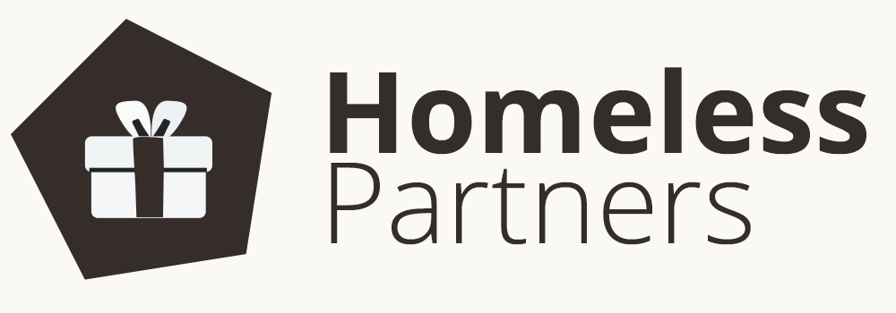
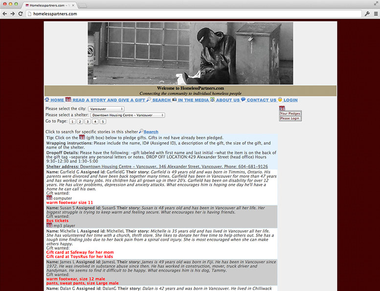
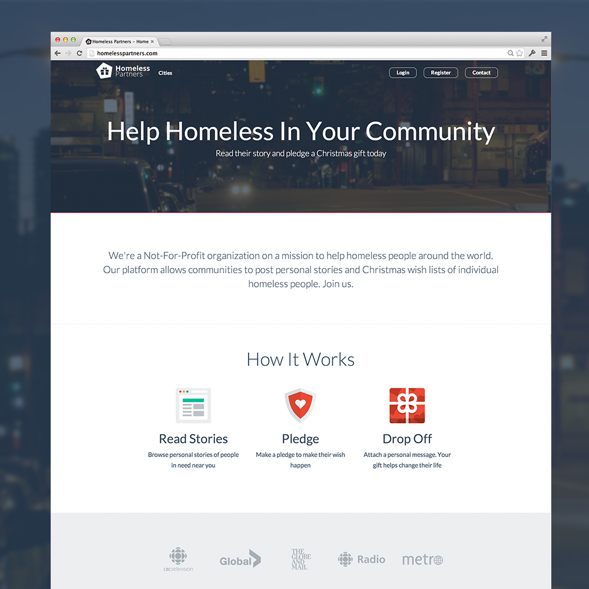
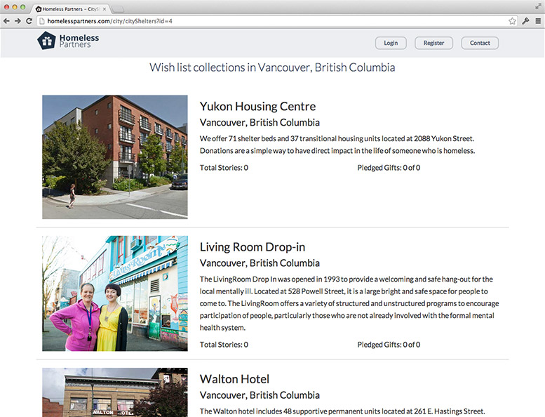

This morning we pushed the new <a href="http://homelesspartners.com">Homeless Partners</a> website. I'm extremely thankful to all of the volunteers that made this possible, all of the indiegogo donors, and our generous sponsors. The new website allows new cities to launch and maintain Christmas Wish List for their community.

<!-- more -->

The rebuild includes an entire overhaul of the website, branding/logo, admin panel, and new marketing tools. Here's a snapshot of the old website:

And a few snaps of the new homepage and pledge page:

Please check it out and pledge a gift to a homeless person today - <a href="http://homelesspartners.com">homelesspartners.com</a>. Look for a part 2 of this post in the new year.

